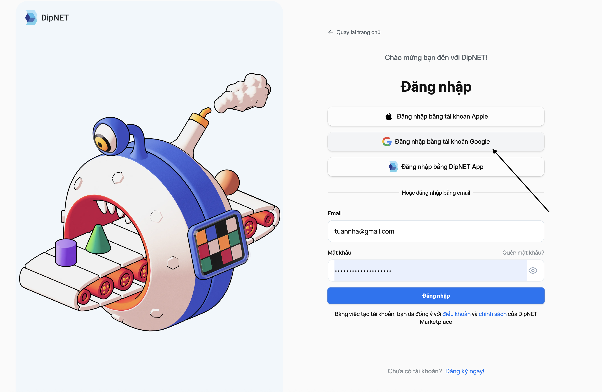
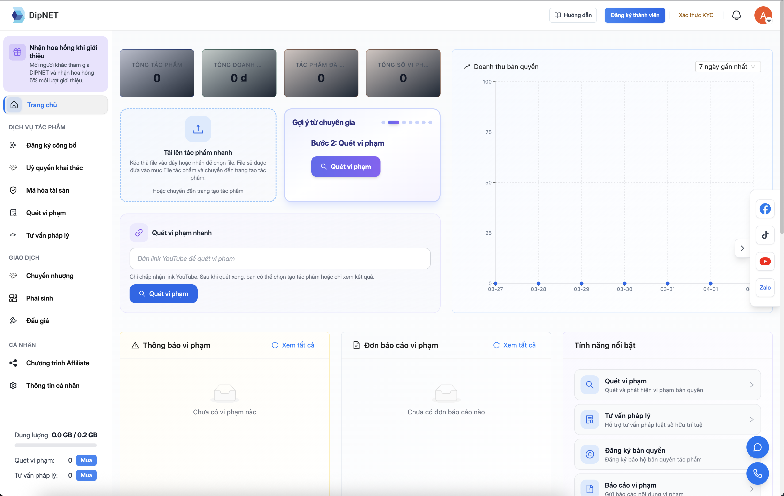

## Các phương thức đăng ký

DipNET hỗ trợ 3 cách đăng ký tài khoản:

<CardGroup cols={3}>
  <Card title="Email & Mật khẩu" icon="envelope">
    Đăng ký bằng địa chỉ email và tạo mật khẩu riêng.
  </Card>
  <Card title="Google" icon="google">
    Đăng ký nhanh bằng tài khoản Google của bạn.
  </Card>
  <Card title="Apple ID" icon="apple">
    Đăng ký bằng Apple ID (hỗ trợ trên iOS/macOS).
  </Card>
</CardGroup>

---

## Đăng ký bằng Email

<Steps>
  <Step title="Truy cập trang đăng ký">
    Vào **dipnet.vn** và nhấn nút **"Đăng ký"** ở góc trên bên phải, hoặc truy cập trực tiếp: `dipnet.vn/register`
  </Step>
  <Step title="Nhập tên và email">
    Điền **Họ và tên** và **Địa chỉ email** của bạn, rồi nhấn **"Tiếp tục"**.
  </Step>
  <Step title="Xác minh OTP">
    Hệ thống gửi mã **OTP 6 chữ số** đến email vừa nhập. Kiểm tra hộp thư (kể cả **Spam/Rác**) và nhập mã OTP vào ô xác nhận.

    <Note>Mã OTP có hiệu lực trong **1 phút**. Nếu hết hạn, nhấn **"Gửi lại mã"** để nhận mã mới.</Note>

  </Step>
  <Step title="Đặt mật khẩu">
    Sau khi OTP được xác nhận, tạo mật khẩu cho tài khoản:
    - Tối thiểu **8 ký tự**
    - Gồm chữ hoa, chữ thường và chữ số
  </Step>
  <Step title="Đăng nhập lần đầu">
    Tài khoản được kích hoạt ngay sau khi đặt mật khẩu. Bạn có thể đăng nhập và bắt đầu trải nghiệm các dịch vụ của DipNET.
  </Step>
</Steps>

---

## Đăng ký bằng Google

<Steps>
  <Step title="Nhấn Đăng ký với Google">
    Trên trang đăng ký, chọn nút **"Tiếp tục với Google"**.
    
  </Step>
  <Step title="Chọn tài khoản Google">
    Trình duyệt sẽ mở popup yêu cầu bạn chọn hoặc đăng nhập vào tài khoản
    Google.
  </Step>
  <Step title="Cho phép quyền truy cập">
    Xem lại và nhấn **"Cho phép"** để DipNET truy cập thông tin cơ bản từ tài
    khoản Google (tên, email, ảnh đại diện).
  </Step>
  <Step title="Hoàn tất">
    Tài khoản DipNET của bạn được tạo tự động. Bạn sẽ được chuyển thẳng vào dashboard sau khi đăng ký.

     

  </Step>
</Steps>

---

## Sau khi đăng ký

Sau khi tạo tài khoản thành công, bạn nên thực hiện các bước tiếp theo:

<Card
  title="Xác minh danh tính (KYC)"
  icon="id-card"
  href="/bat-dau/xac-minh-danh-tinh-kyc"
>
  Xác minh CMND/CCCD để mở khóa đầy đủ tính năng như đăng ký tác phẩm, mua bán,
  mã hóa.
</Card>

---

## Câu hỏi thường gặp

<AccordionGroup>
  <Accordion title="Tôi không nhận được email xác nhận?">
    Hãy kiểm tra thư mục **Spam/Rác** trong hộp thư của bạn. Nếu vẫn không thấy,
    hãy thử đăng nhập và yêu cầu gửi lại email xác nhận, hoặc liên hệ hỗ trợ tại
    **support@DipNET.vn**.
  </Accordion>
  <Accordion title="Tôi có thể đăng ký nhiều tài khoản không?">
    Mỗi cá nhân/tổ chức chỉ được đăng ký **một tài khoản**. Việc tạo nhiều tài
    khoản vi phạm điều khoản sử dụng của DipNET.
  </Accordion>
  <Accordion title="Mật khẩu cần đáp ứng yêu cầu gì?">
    Mật khẩu phải có ít nhất **8 ký tự**, bao gồm ít nhất một **chữ hoa**, một
    **chữ thường** và một **chữ số**.
  </Accordion>
  <Accordion title="Tôi có thể đổi email đăng ký không?">
    Hiện tại, email đăng ký không thể thay đổi sau khi tạo tài khoản. Hãy liên
    hệ hỗ trợ để được tư vấn.
  </Accordion>
</AccordionGroup>
