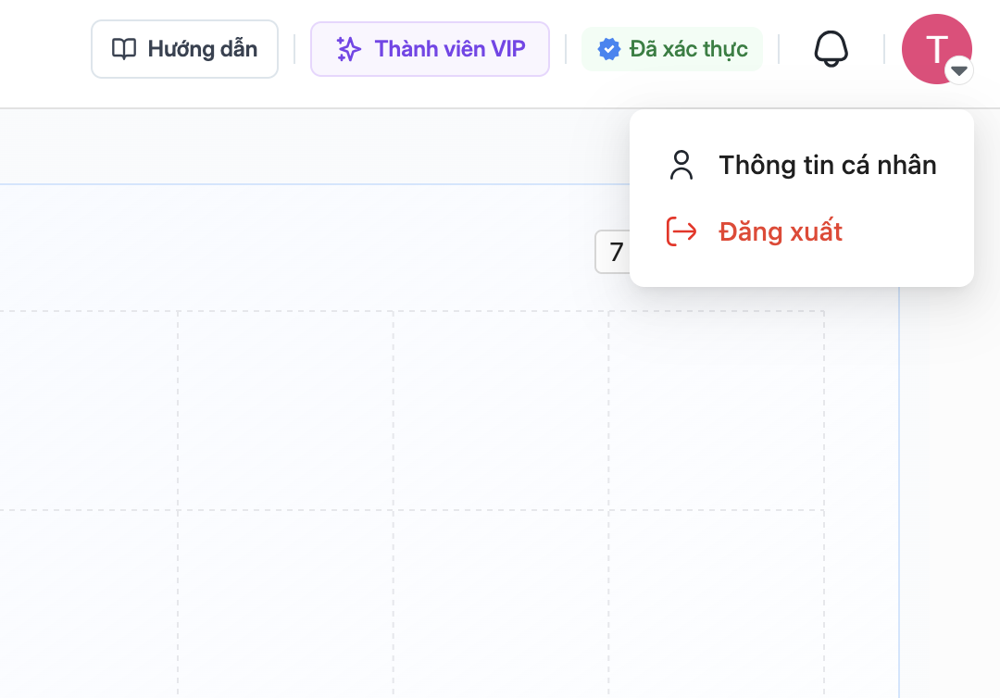
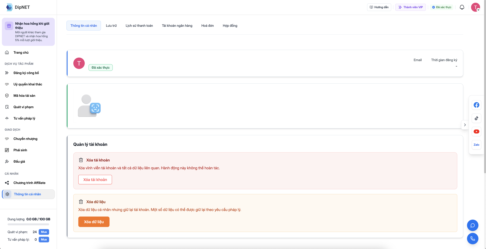

## Hồ sơ cá nhân

Hồ sơ cá nhân trên DipNET giúp người dùng khác nhận biết bạn và tăng độ tin cậy khi giao dịch. Bạn có thể quản lý hồ sơ tại `dipnet.vn/profile/settings`.

---

## Thông tin hồ sơ

<Steps>
  <Step title="Truy cập trang hồ sơ">
    Nhấn vào ảnh đại diện ở góc trên bên phải → chọn **"Hồ sơ cá nhân"**, hoặc truy cập `dipnet.vn/profile/settings`.

    

  </Step>
  <Step title="Cập nhật thông tin cơ bản">
      
    Bạn có thể cập nhật:
    - **Ảnh đại diện** – Tải lên ảnh đại diện của bạn (JPG/PNG, tối đa 2MB)
    - **Tên hiển thị** – Tên hiển thị trên nền tảng
    - **Tiểu sử** – Mô tả ngắn về bản thân hoặc hoạt động sáng tạo
    - **Liên kết mạng xã hội** – Facebook, Instagram, Website, v.v.
  </Step>
  <Step title="Lưu thay đổi">
    Nhấn **"Lưu"** để cập nhật hồ sơ.
  </Step>
</Steps>

---

## Các tab trong hồ sơ

| Tab          | Nội dung                                 |
| ------------ | ---------------------------------------- |
| **Tác phẩm** | Danh sách tác phẩm bạn đã tạo và công bố |
| **Album**    | Bộ sưu tập tác phẩm do bạn tạo           |

---

## Cài đặt tài khoản

Tại `dipnet.vn/profile/settings` bạn có thể:

- **Đổi mật khẩu** – Thay đổi mật khẩu đăng nhập
- **Ngôn ngữ** – Chuyển đổi giữa Tiếng Việt và Tiếng Anh
- **Thông báo** – Tùy chỉnh loại thông báo muốn nhận

---

## Xóa tài khoản

<Warning>
  Xóa tài khoản là hành động **không thể hoàn tác**. Tất cả dữ liệu tác phẩm,
  lịch sử giao dịch và thông tin cá nhân sẽ bị xóa vĩnh viễn.
</Warning>

Nếu muốn xóa tài khoản, vào `dipnet.vn/profile/delete-account` và làm theo hướng dẫn. Bạn sẽ cần xác nhận bằng mật khẩu trước khi thực hiện.

Bạn cũng có thể yêu cầu **xóa dữ liệu cá nhân** (GDPR/PDPA) tại `dipnet.vn/profile/delete-data` mà không cần xóa toàn bộ tài khoản.
