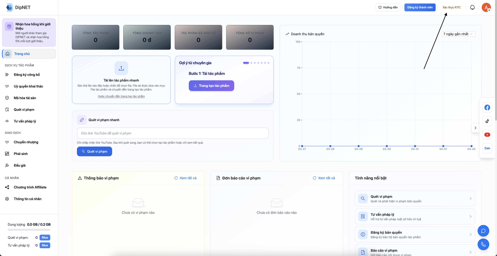
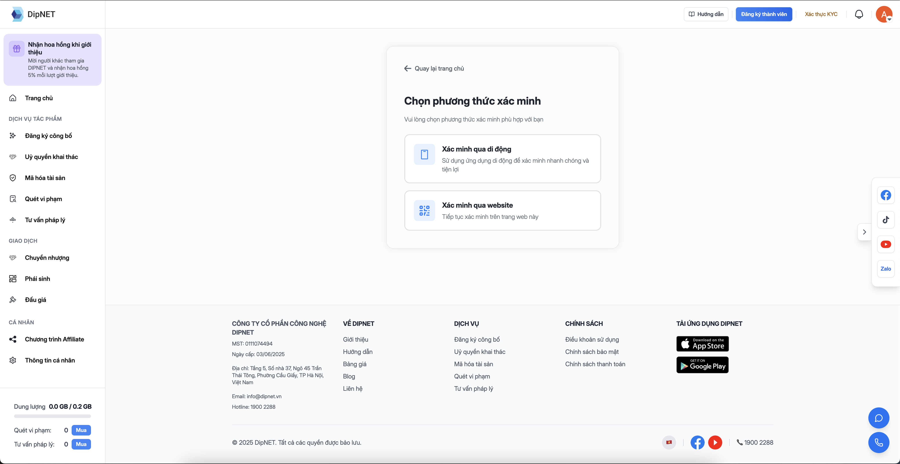

## KYC là gì?

**KYC** (Know Your Customer – Xác minh danh tính khách hàng) là quy trình DipNet yêu cầu người dùng xác minh danh tính thực để đảm bảo tính hợp pháp và minh bạch trong các giao dịch liên quan đến quyền sở hữu trí tuệ.

---

## Tại sao cần thực hiện KYC?

<Info>
  Xác minh KYC là **bắt buộc** để thực hiện các tính năng quan trọng như đăng ký
  tác phẩm, mã hóa blockchain và mua bán chuyển nhượng.
</Info>

| Tính năng                | Chưa KYC | Đã KYC |
| ------------------------ | -------- | ------ |
| Xem thị trường, tác phẩm | ✅       | ✅     |
| Tạo hồ sơ tác phẩm       | ❌       | ✅     |
| Đăng ký công bố (bảo hộ) | ❌       | ✅     |
| Mã hóa blockchain        | ❌       | ✅     |
| Mua/bán nhượng quyền     | ❌       | ✅     |
| Quét vi phạm bản quyền   | ❌       | ✅     |
| Tư vấn pháp lý           | ❌       | ✅     |

---

## Giấy tờ cần chuẩn bị

Bạn cần chuẩn bị **một trong hai** loại giấy tờ sau:

<CardGroup cols={2}>
  <Card title="CCCD (Căn cước công dân)" icon="id-card">
    Căn cước công dân gắn chip hoặc CCCD cũ. Cần chụp ảnh rõ nét mặt trước và
    mặt sau.
  </Card>
  <Card title="CMND (Chứng minh nhân dân)" icon="address-card">
    Chứng minh nhân dân 9 số hoặc 12 số. Cần chụp ảnh rõ nét mặt trước và mặt
    sau.
  </Card>
</CardGroup>

**Lưu ý khi chụp ảnh giấy tờ:**

- Ảnh rõ nét, đủ sáng, không bị mờ hoặc phản sáng
- Hiển thị đầy đủ 4 góc của giấy tờ
- Thông tin trên giấy tờ phải đọc được rõ ràng
- Định dạng: JPG, PNG (tối đa 5MB)

---

## Quy trình xác minh KYC

<Steps>
  <Step title="Truy cập trang xác minh">
    Truy cập **Dashboard** → **Xác thực KYC**, hoặc truy cập trực tiếp `DipNet.vn/profile/verification` đối với xác minh trên website.
    

    Bạn cũng có thể thực hiện KYC trên **thiết bị di động** qua `DipNet.vn/kyc-center`.

  </Step>
  <Step title="Chọn phương thức xác minh">
    Chọn loại giấy tờ muốn sử dụng: **CCCD** hoặc **CMND**.
      
  </Step>
  <Step title="Tải lên ảnh giấy tờ">
    - Tải lên ảnh **mặt trước** của giấy tờ
    - Tải lên ảnh **mặt sau** của giấy tờ
    - Kiểm tra ảnh rõ nét trước khi tiếp tục
  </Step>
  <Step title="Xác minh khuôn mặt (Face Verification)">
    Hệ thống sẽ yêu cầu bạn chụp ảnh selfie để đối chiếu với ảnh trên giấy tờ. Hãy:
    - Nhìn thẳng vào camera
    - Đảm bảo ánh sáng đủ, khuôn mặt không bị che khuất
    - Làm theo hướng dẫn trên màn hình (nghiêng trái, phải, nháy mắt, v.v.)
  </Step>
  <Step title="Chờ duyệt">
    Sau khi nộp, hệ thống sẽ xem xét trong vòng **1–3 ngày làm việc**. Bạn sẽ nhận thông báo qua email khi có kết quả.
  </Step>
</Steps>

---

## Trạng thái xác minh

| Trạng thái         | Mô tả                                 |
| ------------------ | ------------------------------------- |
| **Chưa xác minh**  | Chưa nộp hồ sơ KYC                    |
| **Đang chờ duyệt** | Đã nộp, đang chờ admin xem xét        |
| **Đã xác minh**    | KYC thành công, đầy đủ quyền truy cập |
| **Bị từ chối**     | Hồ sơ không hợp lệ, cần nộp lại       |

---

## KYC trên điện thoại di động

DipNet hỗ trợ thực hiện KYC trực tiếp trên điện thoại di động tại `DipNet.vn/kyc-center` với giao diện được tối ưu cho màn hình nhỏ, bao gồm:

- Chụp ảnh giấy tờ trực tiếp bằng camera điện thoại
- Xác minh khuôn mặt (liveness check) nhanh chóng

---

## Câu hỏi thường gặp

<AccordionGroup>
  <Accordion title="KYC bị từ chối, tôi phải làm gì?">
    Xem lý do từ chối trong email thông báo, sau đó chụp lại ảnh giấy tờ rõ nét
    hơn và nộp lại hồ sơ. Các lý do từ chối thường gặp: ảnh mờ, thiếu mặt sau
    giấy tờ, hoặc ảnh selfie không khớp với giấy tờ.
  </Accordion>
  <Accordion title="Thông tin cá nhân của tôi có được bảo mật không?">
    Có. DipNet mã hóa và bảo mật toàn bộ dữ liệu cá nhân theo quy định Bảo vệ Dữ
    liệu Cá nhân của Việt Nam. Dữ liệu chỉ được dùng để xác minh danh tính và
    không chia sẻ với bên thứ ba.
  </Accordion>
  <Accordion title="Tôi có thể xác minh KYC cho tổ chức/doanh nghiệp không?">
    Hiện tại DipNet hỗ trợ xác minh cho cá nhân. Với tổ chức/doanh nghiệp, vui
    lòng liên hệ **support@dipnet.vn** để được hỗ trợ riêng.
  </Accordion>
  <Accordion title="Tôi đã KYC rồi có cần làm lại không?">
    Không. KYC chỉ cần thực hiện **một lần**. Trạng thái xác minh có hiệu lực
    vĩnh viễn trừ khi có yêu cầu cập nhật đặc biệt.
  </Accordion>
</AccordionGroup>
