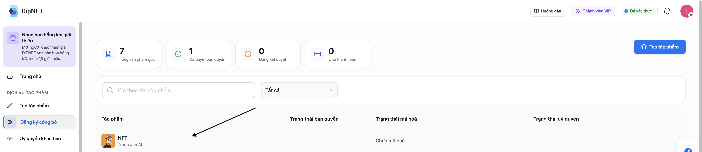
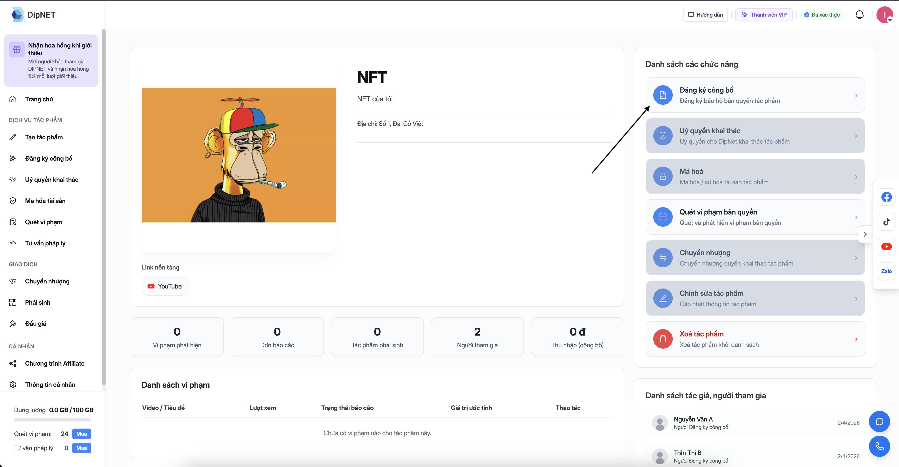

## Trước khi bắt đầu

<CheckList>
  - Tài khoản đã xác minh KYC - Đã tạo tác phẩm gốc với đầy đủ thông tin - Chuẩn
  bị phương thức thanh toán (thẻ ngân hàng/VNPay)
</CheckList>

---

## Quy trình đăng ký

<Steps>
  <Step title="Mở trang chi tiết tác phẩm">
    Truy cập `DipNET.vn/management-studio` → chọn tác phẩm cần đăng ký → xem trang chi tiết.
  

  </Step>
  <Step title="Lựa chọn Đăng ký công bố">
    Trong trang chi tiết tác phẩm, nhấn thẻ **"Đăng ký công bố"** (Shield icon).
  

    Bạn sẽ được điều hướng đến trang `thanh toán`.

  </Step>
  <Step title="Xem thông tin và phí">
    Trang đăng ký công bố hiển thị:
    - Thông tin tác phẩm (tên, danh mục, số định danh)
    - **Phí đăng ký công bố** theo danh mục tác phẩm
    - Tùy chọn **Bản cứng** (Hard Copy) nếu muốn nhận chứng nhận vật lý (có phí thêm)
    - Tùy chọn áp dụng **Mã giảm giá** (nếu có)
  </Step>
  <Step title="Tạo và ký hợp đồng">
    Hệ thống tự động tạo **hợp đồng đăng ký công bố** dạng PDF dựa trên thông tin tác phẩm.

    Chọn hình thức ký số:

    | Hình thức | Mô tả |
    |-----------|-------|
    | **VNPT SmartCA** | Chữ ký số có giá trị pháp lý, được công nhận bởi pháp luật Việt Nam |
    | **Chữ ký mặc định** | Chữ ký điện tử đơn giản, dùng cho mục đích nội bộ |

    Sau khi chọn hình thức, tiến hành ký hợp đồng. Với **VNPT SmartCA**, bạn xác thực và ký qua ứng dụng SmartCA trên điện thoại.

    <Note>
      Chữ ký số VNPT SmartCA được khuyến nghị cho giá trị pháp lý cao nhất.
    </Note>
  </Step>
  <Step title="Thanh toán">
    Sau khi ký hợp đồng thành công, nhấn **"Thanh toán"**. Hệ thống chuyển bạn đến cổng thanh toán **VNPay**.

    Các phương thức thanh toán được hỗ trợ:
    - Thẻ ATM nội địa
    - Thẻ tín dụng/ghi nợ quốc tế (Visa, Mastercard)
    - Chuyển khoản ngân hàng
    - Ví điện tử (MoMo, ZaloPay, v.v.)
  </Step>
  <Step title="Hoàn tất thanh toán">
    Hoàn tất thanh toán trên cổng VNPay. Sau khi thanh toán thành công:
    - Tác phẩm chuyển sang trạng thái **"Đã đăng ký"** (đang chờ duyệt)
    - Bạn nhận email xác nhận thanh toán
    - Hệ thống tạo đơn đăng ký để admin xét duyệt
  </Step>
  <Step title="Chờ xét duyệt">
    Admin DipNET sẽ xem xét hồ sơ trong vòng **1–5 ngày làm việc**. Bạn sẽ nhận thông báo qua email khi có kết quả.
  </Step>
</Steps>

---

## Kết quả xét duyệt

### Được duyệt ✅

Khi đơn được duyệt:

- Tác phẩm chuyển sang trạng thái **"Đã duyệt"** (`copyright_status = approved`)
- Bạn nhận email thông báo kèm thông tin chứng nhận
- **Số định danh** được xác nhận chính thức
- Bạn có thể tiếp tục **mã hóa blockchain** hoặc **đăng bán** tác phẩm

### Bị từ chối ❌

Khi đơn bị từ chối:

- Tác phẩm trở về trạng thái **"Bị từ chối"**
- Email thông báo kèm **lý do từ chối**
- Bạn có thể **nộp lại đơn** sau khi khắc phục vấn đề (cần thanh toán phí lại)

---

## Bảng phí đăng ký công bố

Phí được tính theo danh mục tác phẩm. Xem bảng phí đầy đủ tại [Bảng phí DipNET](/ho-tro/bang-phi).

<Note>
  Phí thanh toán qua VNPay sẽ xuất hiện trong **Lịch sử thanh toán** tại
  `DipNET.vn/profile/payment-history`. Hóa đơn điện tử có thể tải tại
  `DipNET.vn/profile/receipts`.
</Note>

---

## Mã giảm giá

Nếu bạn có mã giảm giá, nhập vào ô **"Mã khuyến mãi"** trên trang thanh toán trước khi nhấn "Thanh toán". Mã giảm giá có thể được phát hành qua các chương trình marketing của DipNET.

---

## Câu hỏi thường gặp

<AccordionGroup>
  <Accordion title="Phí đăng ký có được hoàn trả nếu đơn bị từ chối không?">
    Phí đăng ký công bố **không được hoàn trả** trong trường hợp đơn bị từ chối.
    Hãy đảm bảo thông tin tác phẩm đầy đủ và chính xác trước khi nộp.
  </Accordion>
  <Accordion title="Tôi có thể nộp đơn lại sau khi bị từ chối không?">
    Có. Sau khi đơn bị từ chối, bạn có thể chỉnh sửa thông tin tác phẩm và nộp
    lại. Mỗi lần nộp sẽ tính phí mới.
  </Accordion>
  <Accordion title="Tôi có thể theo dõi tiến độ xét duyệt ở đâu?">
    Vào trang chi tiết tác phẩm hoặc `DipNET.vn/copyright` để xem trạng thái
    đơn. Bạn cũng sẽ nhận thông báo qua email khi có cập nhật.
  </Accordion>
  <Accordion title="Thanh toán thành công nhưng trạng thái chưa cập nhật?">
    Đôi khi cần vài phút để hệ thống xử lý. Nếu sau 30 phút vẫn chưa cập nhật,
    hãy liên hệ hỗ trợ và cung cấp mã giao dịch VNPay.
  </Accordion>
</AccordionGroup>
