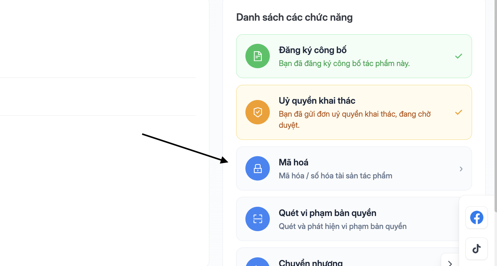
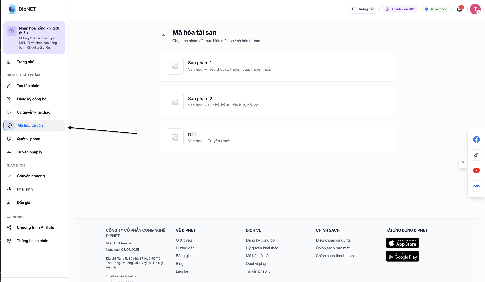

## Kiểm tra điều kiện trước khi mã hóa

<CheckList>
  - Tác phẩm đã được **duyệt đăng ký công bố** - Tác phẩm là **tác phẩm gốc**
  (không phải phái sinh) - Tác phẩm **chưa được mã hóa** hoặc **chưa có yêu cầu
  mã hóa đang xử lý** - Tất cả người tham gia có tài khoản DipNET đã **liên kết
  ví điện tử EVM**
</CheckList>

---

## Trạng thái Mã hóa

Trên trang chi tiết tác phẩm, thẻ **Mã hóa** hiển thị các trạng thái sau:

| Màu thẻ  | Trạng thái    | Ý nghĩa                                                      |
| -------- | ------------- | ------------------------------------------------------------ |
| ⚫ Xám   | Disabled      | Tác phẩm chưa được duyệt công bố. Cần đăng ký công bố trước. |
| 🟡 Vàng  | Đang xử lý    | Đã thanh toán, đang chờ admin mã hóa.                        |
| 🟢 Xanh  | Đã mã hóa     | Tác phẩm đã được số hóa lên blockchain.                      |
| ⚪ Trắng | Có thể mã hóa | Đủ điều kiện, nhấn để bắt đầu.                               |

---

## Quy trình mã hóa tác phẩm

<Steps>
  <Step title="Truy cập vào sản phẩm và chọn mục mã hoá sản phẩm">

    

    Hoặc truy cập nhanh ở mục Mã hoá tài sản ở thanh tiện ích

    

  </Step>
  <Step title="Xem thông tin và phí">
    Trang mã hóa hiển thị:
    - Thông tin tác phẩm (tên, số định danh, danh mục)
    - **Phí mã hóa** theo danh mục tác phẩm
    - Thông tin người tham gia sẽ được đăng ký lên blockchain
  </Step>
  <Step title="Liên kết ví EVM (nếu chưa có)">
    Nếu bạn hoặc người đồng sở hữu chưa liên kết ví EVM, hệ thống sẽ nhắc nhở. Cần liên kết ví trước khi tiếp tục.

    <Note>
      Ví EVM là ví Ethereum (MetaMask, Trust Wallet, v.v.). Địa chỉ ví này sẽ được ghi lên blockchain để xác định quyền sở hữu.
    </Note>

  </Step>
  <Step title="Thanh toán phí mã hóa">
    Nhấn **"Thanh toán"**. Hệ thống tạo link thanh toán VNPay.

    Sau khi thanh toán thành công:
    - Tác phẩm chuyển sang trạng thái **"Đang mã hóa"** (thẻ vàng)
    - Bạn nhận email xác nhận
    - Đơn mã hóa được tạo, chờ admin xét duyệt

  </Step>
  <Step title="Chờ admin xét duyệt và mã hóa">
    Admin DipNET sẽ xem xét đơn mã hóa và thực hiện:
    - Tạo metadata NFT từ thông tin tác phẩm
    - Upload metadata lên Amazon S3
    - Gọi smart contract tạo IP (createIP) trên blockchain Ethereum
    - Chờ giao dịch được đóng vào block

    Thời gian xét duyệt: **1–5 ngày làm việc**.

  </Step>
  <Step title="Nhận thông báo kết quả">
    Sau khi admin xử lý:
    - **Được duyệt**: Tác phẩm chuyển sang "Đã mã hóa" (thẻ xanh). NFT được tạo với Token ID riêng. Bạn nhận email kèm thông tin Token ID và Transaction Hash.
    - **Bị từ chối**: Tác phẩm trở về trạng thái trước, bạn nhận email kèm lý do.
  </Step>
</Steps>

---

## Liên kết ví EVM

Để đăng ký thông tin lên blockchain, tất cả người tham gia **có tài khoản DipNET** cần liên kết ví EVM:

1. Vào **Hồ sơ** → **Cài đặt** (hoặc khu vực ví)
2. Chọn **"Liên kết ví EVM"**
3. Nhập địa chỉ ví Ethereum (dạng `0x...`)
4. Xác nhận địa chỉ

<Warning>
  Đảm bảo nhập **chính xác** địa chỉ ví EVM. Địa chỉ sai sẽ gán quyền sở hữu NFT
  cho người khác và **không thể sửa** sau khi đã lên blockchain.
</Warning>

---

## Câu hỏi thường gặp

<AccordionGroup>
  <Accordion title="Phí mã hóa có được hoàn trả nếu bị từ chối không?">
    Phí mã hóa **không hoàn trả** nếu đơn bị từ chối. Hãy đảm bảo đủ điều kiện
    trước khi thanh toán.
  </Accordion>
  <Accordion title="Tôi có thể hủy yêu cầu mã hóa sau khi đã thanh toán không?">
    Sau khi thanh toán, yêu cầu mã hóa đã được tạo và không thể hủy. Bạn cần chờ
    kết quả xét duyệt từ admin.
  </Accordion>
  <Accordion title="Nếu người đồng sở hữu không có ví EVM thì sao?">
    Người không có tài khoản DipNET có thể không cần ví EVM. Nhưng tất cả người
    tham gia **có tài khoản DipNET** phải liên kết ví EVM trước khi có thể thực
    hiện mã hóa.
  </Accordion>
  <Accordion title="Sau khi mã hóa, tôi có thể thêm/xóa tác giả không?">
    Không. Thông tin tác giả trên blockchain là **bất biến** (immutable). Sau
    khi mã hóa, danh sách tác giả không thể thay đổi.
  </Accordion>
  <Accordion title="Mã hóa mất phí blockchain (gas fee) không?">
    Phí gas được DipNET thanh toán từ ví platform. Người dùng chỉ trả **phí mã
    hóa** trên DipNET, không cần trả phí gas riêng.
  </Accordion>
</AccordionGroup>
