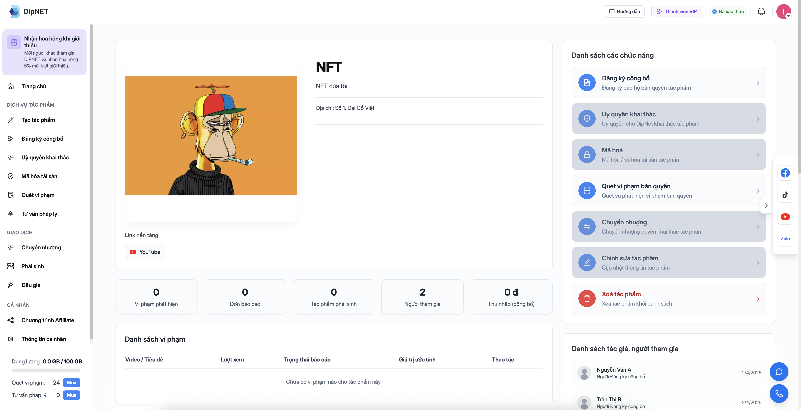

## Management Studio

**Management Studio** là trung tâm quản lý tất cả tác phẩm của bạn trên DipNET, truy cập tại `dipnet.vn/management-studio`.

---

## Các tab quản lý

<CardGroup cols={2}>
  <Card title="Tác phẩm gốc" icon="music" href="/tac-pham/tao-tac-pham-goc">
    Quản lý tất cả tác phẩm gốc: xem trạng thái, chỉnh sửa, đăng ký công bố, mã
    hóa.
  </Card>
  <Card
    title="Tác phẩm phái sinh"
    icon="code-branch"
    href="/tac-pham/tac-pham-phai-sinh"
  >
    Quản lý các tác phẩm phái sinh bạn đã đăng ký từ tác phẩm gốc của người
    khác.
  </Card>
</CardGroup>

---

## Tác phẩm gốc – Trạng thái và ý nghĩa

### Trạng thái Đăng ký công bố (Copyright Status)

| Trạng thái         | Biểu tượng | Ý nghĩa                                |
| ------------------ | ---------- | -------------------------------------- |
| **Chưa đăng ký**   | ⚪         | Tác phẩm mới tạo, chưa nộp đăng ký     |
| **Đã đăng ký**     | 🟡         | Đã nộp đơn, đang chờ admin xét duyệt   |
| **Đã duyệt**       | 🟢         | Được cấp chứng nhận bảo hộ bản quyền   |
| **Bị từ chối**     | 🔴         | Đơn đăng ký bị từ chối, có thể nộp lại |
| **Chờ thanh toán** | 🟠         | Đã nộp đơn, cần hoàn tất thanh toán    |
| **Chờ thông tin**  | 🔵         | Cần bổ sung thông tin người tham gia   |

### Trạng thái Mã hóa (Encode Status)

| Trạng thái      | Biểu tượng | Ý nghĩa                                |
| --------------- | ---------- | -------------------------------------- |
| **Chưa mã hóa** | ⚪         | Chưa đăng ký mã hóa                    |
| **Đang mã hóa** | 🟡         | Đã thanh toán, đang chờ admin xử lý    |
| **Đã mã hóa**   | 🟢         | Tác phẩm đã được số hóa lên blockchain |

### Trạng thái Uỷ quyền khai thác (Authorization Status)

| Trạng thái        | Biểu tượng | Ý nghĩa                                              |
| ----------------- | ---------- | ---------------------------------------------------- |
| **Chưa uỷ quyền** | ⚪         | Chưa ký hợp đồng uỷ quyền khai thác                 |
| **Đã uỷ quyền**   | 🟢         | Đã ký hợp đồng, DipNET được phép khai thác tác phẩm |

---

## Xem chi tiết tác phẩm

Nhấn vào tên tác phẩm để xem trang chi tiết của sản phẩm, bao gồm:

- **Thông tin cơ bản**: Tên, danh mục, mô tả, số định danh
- **Trạng thái bảo hộ**: Copyright status, encode status
- **Người tham gia**: Danh sách tác giả và vai trò
- **Tài liệu đính kèm**: File tác phẩm đã tải lên
- **Lịch sử**: Các hành động đã thực hiện trên tác phẩm
- **Thẻ hành động**:
  - 🛡️ **Đăng ký công bố** – Nộp đơn bảo hộ bản quyền
  - ⛏️ **Uỷ quyền khai thác** – Uỷ quyền cho DipNET khai thác tác phẩm
  - 🔐 **Mã hóa** – Số hóa lên blockchain (cần được duyệt công bố trước)
  - 🤝 **Uỷ quyền** – Uỷ quyền sử dụng tác phẩm
  - 💰 **Bán** – Đăng bán nhượng quyền tác phẩm

  

---

## Chỉnh sửa tác phẩm

<Steps>
  <Step title="Mở trang chỉnh sửa">
    Trong trang chi tiết tác phẩm, chọn **"Chỉnh sửa tác phẩm"**.
  </Step>
  <Step title="Cập nhật thông tin">
    Bạn có thể cập nhật: - Tên tác phẩm - Mô tả - Từ khóa - Ảnh bìa - File tác
    phẩm - Thông tin người tham gia
  </Step>
  <Step title="Lưu thay đổi">
    Nhấn **"Lưu"** để cập nhật. Lưu ý: một số trường không thể thay đổi sau khi
    đã được duyệt công bố.
  </Step>
</Steps>

---

## Kho IP (IP Warehouse)

Tại `dipnet.vn/warehouse-ip`, bạn có thể xem toàn bộ **tài sản trí tuệ** của mình, bao gồm cả các tác phẩm bạn đã mua quyền sở hữu từ người khác.

---

## Câu hỏi thường gặp

<AccordionGroup>
  <Accordion title="Tôi có thể tạo bao nhiêu tác phẩm?">
    Số lượng tác phẩm không giới hạn. Tuy nhiên, lượt **đăng ký công bố** bị
    giới hạn theo gói dịch vụ. Tài khoản miễn phí có giới hạn lượt tạo tác phẩm;
    gói thành viên mở khóa không giới hạn.
  </Accordion>
  <Accordion title="Thẻ Mã hóa bị xám và không nhấn được?">
    Thẻ Mã hóa chỉ hoạt động khi tác phẩm đã được **duyệt đăng ký công bố**
    (copyright_status = approved). Bạn cần hoàn thành bước đăng ký công bố
    trước.
  </Accordion>
  <Accordion title="Làm thế nào để thêm tác giả sau khi tạo tác phẩm?">
    Vào chỉnh sửa tác phẩm và thêm người tham gia trong phần "Người tham gia".
    Lưu ý rằng sau khi đã mã hóa blockchain, thông tin người tham gia không thể
    thay đổi.
  </Accordion>
</AccordionGroup>
