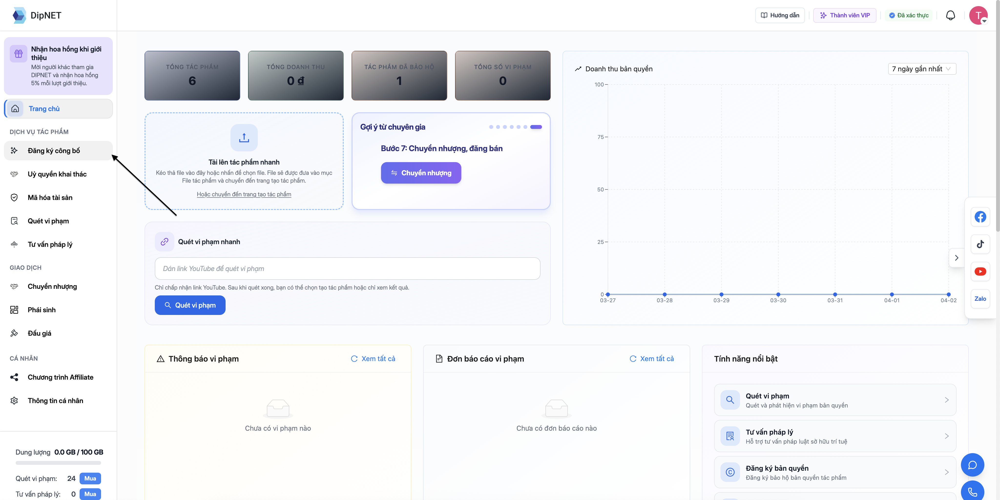
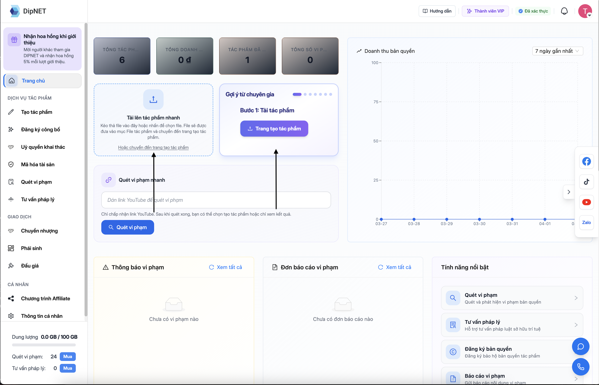

## Tác phẩm gốc là gì?

**Tác phẩm gốc** (Original Work) là tác phẩm do bạn sáng tác hoặc đồng sáng tác. Đây là đơn vị cơ bản để đăng ký bảo hộ bản quyền và thực hiện các tính năng khác trên DipNET.

<Info>
  Bạn cần hoàn thành **xác minh KYC** trước khi có thể tạo tác phẩm. Xem [hướng
  dẫn KYC](/bat-dau/xac-minh-danh-tinh-kyc).
</Info>

---

## Giới hạn tạo tác phẩm

| Loại tài khoản              | Số lượt tạo tác phẩm        |
| --------------------------- | --------------------------- |
| **Miễn phí**                | Số lượt giới hạn theo quota |
| **Thành viên (Membership)** | Không giới hạn              |

Khi hết lượt tạo tác phẩm, bạn có thể mua thêm lượt hoặc **đăng ký gói thành viên**. Xem [Gói thành viên](/goi-dich-vu/goi-thanh-vien).

---

## Hướng dẫn tạo tác phẩm gốc

<Steps>
  <Step title="Truy cập trang tạo tác phẩm">
    Truy cập `dipnet.vn/create` hoặc chọn **"Đăng ký công bố"** trong menu điều hướng.
      

   **Mẹo** Bạn cũng có thể sử dụng thanh công cụ điều hướng nhanh để tạo tác phẩm nhanh, tự động điều hướng tới trang tạo tác phẩm sau khi thao tác
      

  </Step>
  <Step title="Điền thông tin cơ bản">
    **Thông tin bắt buộc:**
    - **Tên tác phẩm** – Tiêu đề của tác phẩm
    - **Danh mục** – Chọn loại tác phẩm (Âm nhạc, Hình ảnh, Video, Văn học, Phần mềm, Thiết kế, v.v.)
    - **Tỉnh/Thành phố** – Nơi đăng ký tác phẩm

    **Thông tin khuyến nghị:**
    - **Mô tả** – Nội dung mô tả tác phẩm
    - **Từ khóa** – Giúp người dùng khác tìm thấy tác phẩm
    - **Ảnh bìa** – Ảnh đại diện cho tác phẩm

  </Step>
  <Step title="Thêm file tác phẩm">
    Tải lên file tác phẩm của bạn (âm thanh, hình ảnh, video, tài liệu, v.v.).

    - Hệ thống hỗ trợ nhiều định dạng file phổ biến
    - Dung lượng tối đa phụ thuộc vào **gói dung lượng** của bạn
    - Xem [Gói dung lượng](/goi-dich-vu/goi-dung-luong) để tăng giới hạn

  </Step>
  <Step title="Thêm liên kết nền tảng (tùy chọn)">
    Nếu tác phẩm đã được phát hành trên các nền tảng số, bạn có thể thêm liên kết để tăng độ xác thực:
    - YouTube, Spotify, SoundCloud
    - Apple Music, Deezer, Tidal
    - Các nền tảng streaming khác
  </Step>
  <Step title="Thêm người tham gia (Participants)">
    Nếu tác phẩm có **nhiều tác giả hoặc đồng sở hữu**, bạn cần khai báo thông tin từng người:
    - **Tên đầy đủ**
    - **CCCD/CMND**
    - **Email** (để nhận thông báo)
    - **Vai trò** – DipNET hỗ trợ 20+ vai trò, bao gồm:

    | Vai trò | Mô tả | Có thể bán? |
    |---------|-------|------------|
    | Owner (Chủ sở hữu) | Quyền cao nhất | ✅ |
    | Co-Owner (Đồng sở hữu) | Đồng quyền sở hữu | ✅ |
    | Representative (Đại diện) | Đại diện thương mại | ✅ |
    | Author (Tác giả) | Người sáng tác | ❌ |
    | Co-Author (Đồng tác giả) | Đồng sáng tác | ❌ |
    | Composer (Nhạc sĩ), Lyricist (Tác giả lời), Producer, Performer, ... | Vai trò chuyên môn | ❌ |

    <Note>
      Tất cả người tham gia có tài khoản DipNET cần liên kết **ví điện tử EVM** để có thể đăng ký lên blockchain sau này.
    </Note>

  </Step>
  <Step title="Xem lại và tạo tác phẩm">
    Kiểm tra lại toàn bộ thông tin và nhấn **"Tạo tác phẩm"**. Hệ thống sẽ tạo một **Số định danh** (Registration Number) duy nhất cho tác phẩm của bạn.
  </Step>
</Steps>

---

## Số định danh tác phẩm

Sau khi tạo tác phẩm thành công, hệ thống tự động cấp **Số định danh** (Registration Number) theo định dạng:

```
[Mã tỉnh][Thế kỷ][Năm][Mã loại tài sản][Chuỗi ngẫu nhiên]
```

Ví dụ: `012502512345`

- `01` – Mã tỉnh (Hà Nội)
- `0` – Thế kỷ 21
- `25` – Năm 2025
- `025` – Mã loại tài sản
- `12345` – Chuỗi ngẫu nhiên duy nhất

Số định danh này được hiển thị trên trang chi tiết tác phẩm và dùng để tra cứu, xác minh.

---

## Sau khi tạo tác phẩm

Sau khi tạo thành công, tác phẩm có trạng thái **"Chưa đăng ký công bố"**. Bạn có thể:

<CardGroup cols={2}>
  <Card
    title="Đăng ký công bố"
    icon="shield-check"
    href="/dang-ky-cong-bo/quy-trinh-va-phi"
  >
    Nộp đơn đăng ký công bố để nhận chứng nhận bảo hộ bản quyền chính thức.
  </Card>
  <Card title="Chỉnh sửa thông tin" icon="pen-to-square">
    Vào trang chi tiết tác phẩm và nhấn "Chỉnh sửa" để cập nhật thông tin.
  </Card>
</CardGroup>

---

## Câu hỏi thường gặp

<AccordionGroup>
  <Accordion title="Tôi có thể tạo tác phẩm cho người khác không?">
    Không. Mỗi tác phẩm phải được tạo bởi chính tác giả hoặc người đại diện hợp
    pháp. Thông tin đăng ký gắn với tài khoản của bạn.
  </Accordion>
  <Accordion title="Tôi có thể xóa tác phẩm sau khi tạo không?">
    Tác phẩm **chưa đăng ký công bố** có thể bị xóa. Tác phẩm đã được duyệt công
    bố hoặc đã mã hóa không thể xóa vì đã là hồ sơ pháp lý.
  </Accordion>
  <Accordion title="File tác phẩm có thể ở định dạng nào?">
    DipNET hỗ trợ các định dạng phổ biến: MP3, WAV, FLAC (âm nhạc), JPG, PNG,
    GIF, SVG (hình ảnh), MP4, MOV (video), PDF, DOCX (tài liệu), ZIP (phần mềm).
    Dung lượng tối đa phụ thuộc vào gói dung lượng của bạn.
  </Accordion>
  <Accordion title="Một tác phẩm có thể có nhiều chủ sở hữu không?">
    Có. Bạn có thể thêm nhiều người tham gia với các vai trò khác nhau. Chủ sở
    hữu chính (Owner) là người tạo tác phẩm trên DipNET và có quyền quản lý cao
    nhất.
  </Accordion>
</AccordionGroup>
