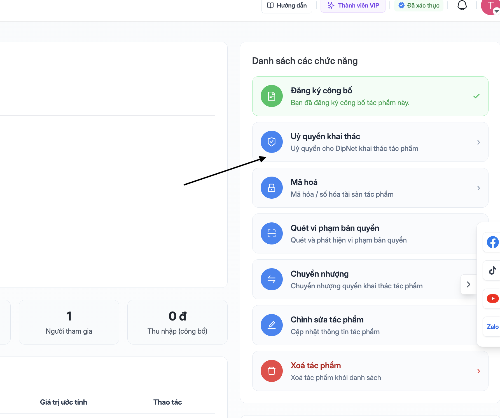
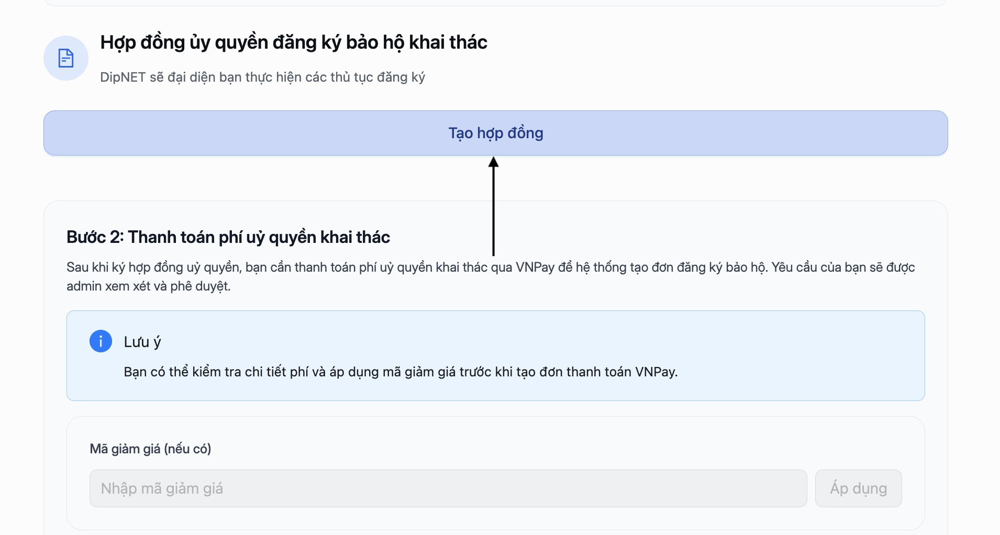
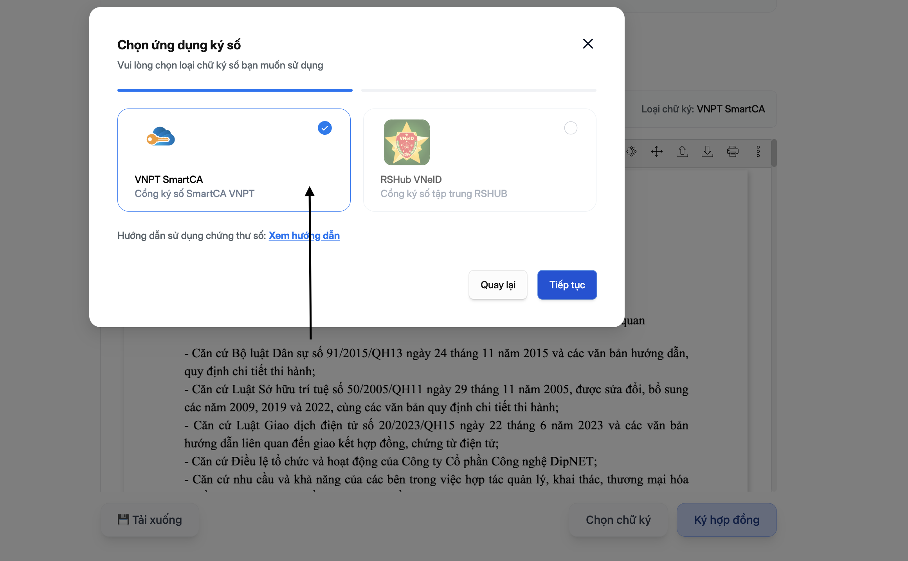
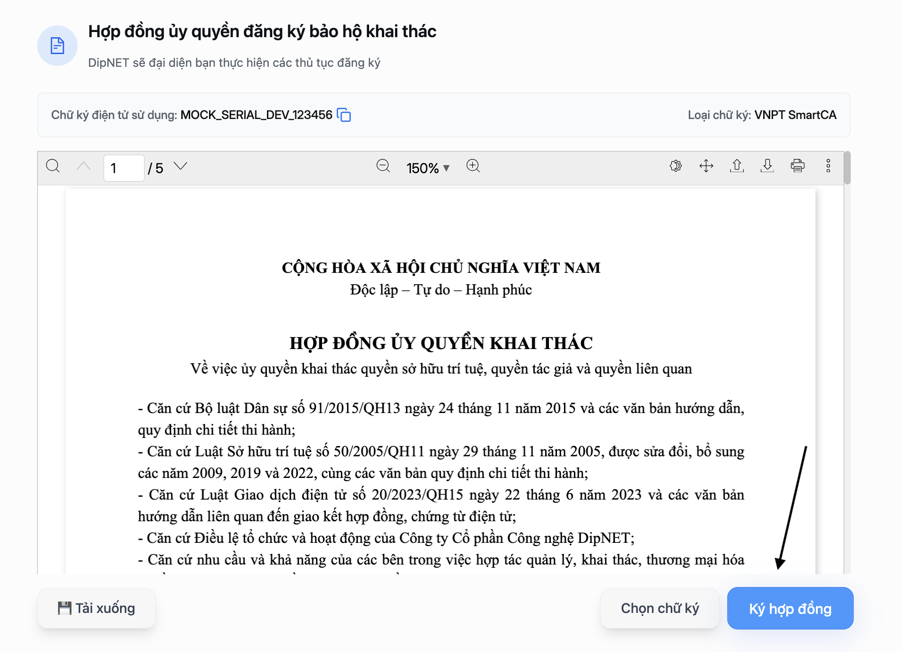
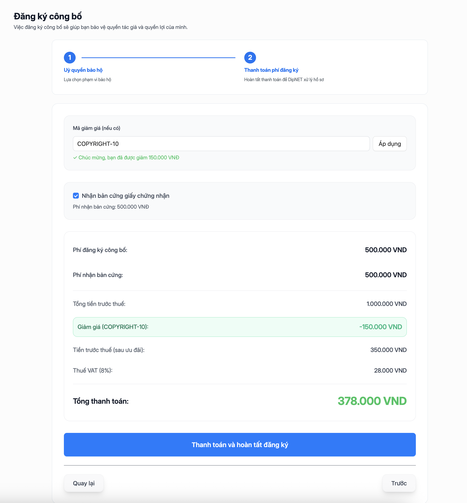
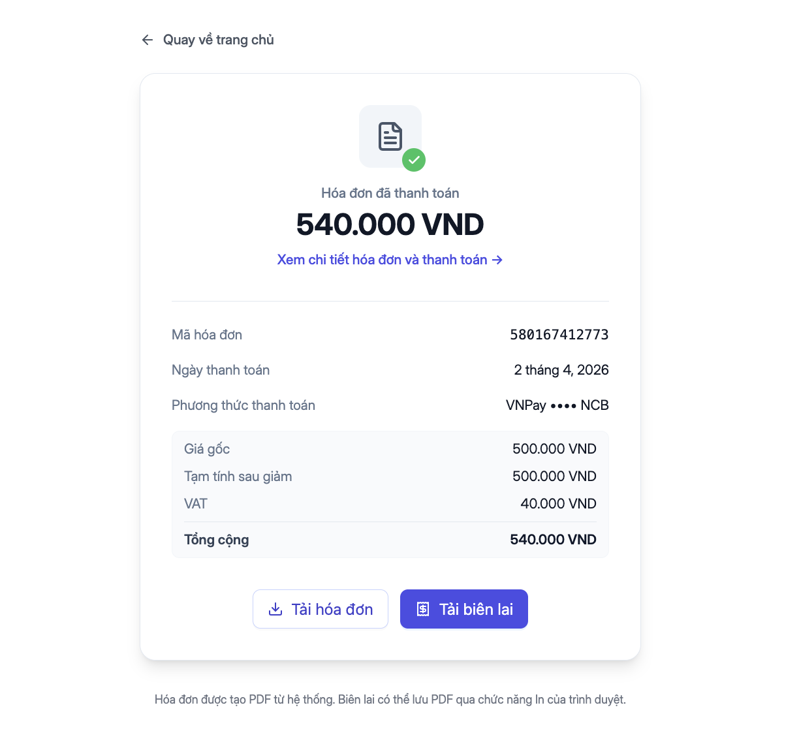
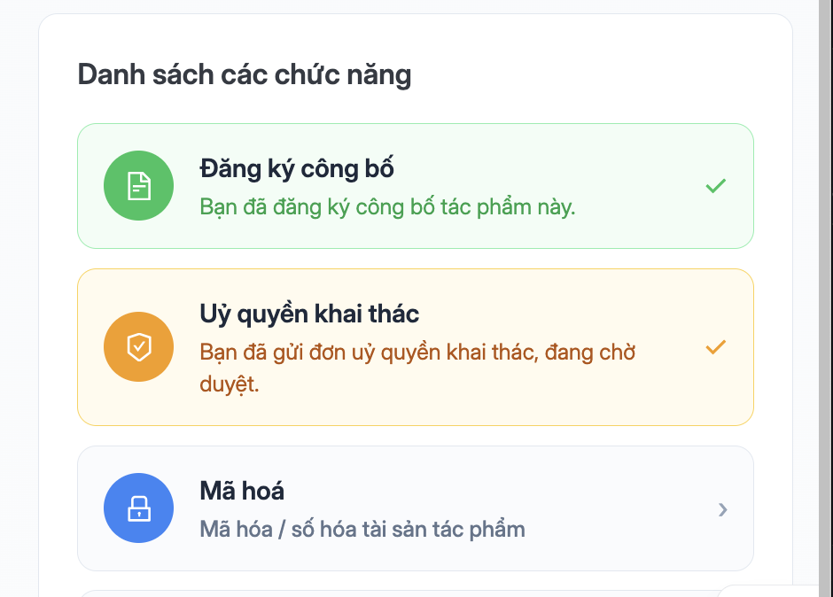

## Hai luồng uỷ quyền

DIPNet hỗ trợ hai hình thức uỷ quyền khác nhau:

<CardGroup cols={2}>
  <Card title="Uỷ quyền khai thác" icon="handshake">
    Uỷ quyền cho DipNET khai thác thương mại tác phẩm. **Không cần thanh toán
    phí**, chỉ cần ký hợp đồng số.
  </Card>
  <Card title="Uỷ quyền đăng ký công bố" icon="shield-check">
    Uỷ quyền cho DipNET thực hiện đăng ký bảo hộ bản quyền. Cần ký hợp đồng và
    **thanh toán phí** đăng ký.
  </Card>
</CardGroup>

---

## Quy trình uỷ quyền khai thác

<Steps>
  <Step title="Mở trang chi tiết tác phẩm">
    Truy cập `DipNET.vn/management-studio` → chọn tác phẩm cần uỷ quyền → xem trang chi tiết.

    

  </Step>
  <Step title="Lựa chọn Uỷ quyền khai thác">
    Trong trang chi tiết tác phẩm, nhấn thẻ **"Uỷ quyền"** (Handshake icon).

    

    <Warning>Chỉ có thể đăng ký uỷ quyền khai thác nếu tác phẩm đã được **duyệt đăng ký công bố**.</Warning>

  </Step>
  <Step title="Tạo và ký hợp đồng">
    Chọn **"Tạo hợp đồng"**. Hệ thống tự động tạo **hợp đồng uỷ quyền khai thác** dạng PDF dựa trên thông tin tác phẩm.

    

    Hợp đồng được tạo thành công sẽ hiển thị và bạn chọn hình thức ký số:

    | Hình thức | Mô tả |
    |-----------|-------|
    | **VNPT SmartCA** | Chữ ký số có giá trị pháp lý, được công nhận bởi pháp luật Việt Nam |
    | **Chữ ký mặc định** | Chữ ký điện tử đơn giản, dùng cho mục đích nội bộ |

    

    Sau khi chọn hình thức, tiến hành ký hợp đồng. Với **VNPT SmartCA**, bạn xác thực và ký qua ứng dụng SmartCA trên điện thoại.

    <Note>
      Chữ ký số VNPT SmartCA được khuyến nghị cho giá trị pháp lý cao nhất. Sau khi ký thành công, bạn sẽ được điều hướng tới bước xác nhận.
    </Note>

  </Step>
  <Step title="Xem thông tin và phí">
    Sau khi quá trình ký số diễn ra thành công, bạn sẽ được điều hướng tới phần hoá đơn của đơn đăng ký uỷ quyền khai thác.

    Trang hoá đơn hiển thị:
    - **Phí uỷ quyền khai thác** theo danh mục tác phẩm
    - Tùy chọn **Bản cứng** (Hard Copy) nếu muốn nhận hợp đồng vật lý (có phí thêm)
    - Tùy chọn áp dụng **Mã giảm giá** (nếu có)

    **Mẹo**: Hãy thường xuyên cập nhật các thông báo mới nhất từ DipNET để thu thập các mã giảm giá.

  </Step>
  <Step title="Thanh toán">
    Lựa chọn **"Thanh toán"**. Hệ thống chuyển bạn đến cổng thanh toán **VNPay**.

    Các phương thức thanh toán được hỗ trợ:
    - Thẻ ATM nội địa
    - Thẻ tín dụng/ghi nợ quốc tế (Visa, Mastercard)
    - Chuyển khoản ngân hàng

  </Step>
  <Step title="Hoàn tất thanh toán">
    Hoàn tất thanh toán trên cổng VNPay. Sau khi thanh toán thành công:
    - Yêu cầu uỷ quyền chuyển sang trạng thái **"Đang chờ duyệt"**
    - Bạn nhận email xác nhận thanh toán
    - Hệ thống tạo hồ sơ uỷ quyền để admin xét duyệt

      

    Bạn có thể tải về hoá đơn / in hoá đơn để lưu lại giao dịch.

  </Step>
  <Step title="Chờ xét duyệt">

    

    Admin DipNET sẽ xem xét hồ sơ trong vòng **1–5 ngày làm việc**. Bạn sẽ nhận thông báo qua email khi có kết quả.
  </Step>
</Steps>

## Thời gian xét duyệt

| Loại | Thời gian dự kiến |
|------|------------------|
| Xét duyệt thông thường | 1–5 ngày làm việc |
| Xét duyệt ưu tiên (nếu có) | 1 ngày làm việc |

Thời gian có thể kéo dài hơn trong các dịp lễ hoặc khi số lượng đơn cao.

---

## Xem hợp đồng đã ký

Tất cả hợp đồng uỷ quyền đã ký lưu tại `dipnet.vn/profile/contract`. Bạn có thể:

- Xem danh sách hợp đồng
- Tải xuống bản PDF
- Kiểm tra trạng thái hợp đồng

---

## Câu hỏi thường gặp

<AccordionGroup>
  <Accordion title="Uỷ quyền có nghĩa là tôi mất quyền sở hữu tác phẩm không?">
    Không. Uỷ quyền khai thác **không chuyển quyền sở hữu**. Bạn vẫn là chủ sở
    hữu tác phẩm; DipNET chỉ được phép khai thác trong phạm vi được uỷ quyền.
  </Accordion>
  <Accordion title="Tôi có thể thu hồi uỷ quyền không?">
    Khả năng thu hồi uỷ quyền phụ thuộc vào điều khoản hợp đồng đã ký. Liên hệ
    support@dipnet.vn để được tư vấn.
  </Accordion>
  <Accordion title="Chữ ký số VNPT SmartCA có bắt buộc không?">
    Không bắt buộc, nhưng được khuyến nghị vì có giá trị pháp lý cao hơn. Bạn có
    thể dùng chữ ký mặc định cho các uỷ quyền nội bộ.
  </Accordion>
  <Accordion title="Tác phẩm đã uỷ quyền có thể bán không?">
    Có. Uỷ quyền khai thác và bán nhượng quyền là hai tính năng độc lập. Bạn vẫn
    có thể đăng bán tác phẩm trên thị trường dù đã uỷ quyền.
  </Accordion>
</AccordionGroup>
